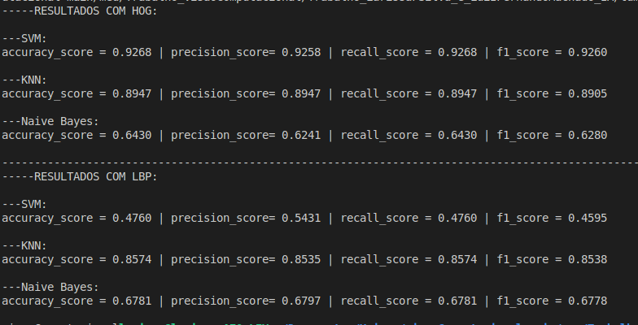

# Extração de Características e Classificação de Imagens de Tomografias de Tumores

## Introdução

O objetivo do presente trabalho foi o desenvolvimento de técnicas de classificação de imagens de tomografia de tumores cerebrais com o uso do dataset brain tumor mri, com o uso de técnicas de extração de características  com HOG (Histogram of Oriented Gradients) e LBP (Local Binary Patterns) e além da extração de características foi preciso realizar a classificação das imagens que foram usados SVM (Support Vector Machine), KNN (K-Nearest Neighbors) e NB (Naive Bayes) onde os classificadores treinariam diante de 4 classes do conjunto de dados, sendo elas: glioma, meningioma, pituitária e sem tumor.

## Metodologia

Foram usadas algumas libs em especial que poderão ser instaladas com o uso do comando:
``` pip install -r requirements.txt ``` <br>
Foi usado o dataset disponível no site kaggle ```https://www.kaggle.com/datasets/masoudnickparvar/brain-tumor-mri-dataset```

### Preprocessamento

Foi feito o preprocessamento das imagens para escala de cinza, equalização de histograma e redimensionamento de 128x128px.<br>

### Extração de Características

Foram usadas as técnicas de extração de características  das imagens (depois de pré processadas), as extrações de característcias foram feitas com técinas HOG e LBP

### Classificadores

Foram usados Support Vector Machine, K-Nearest Neighbors e Naive Bayes para a classificação das imagens de tumores cerebrais, as classificações são feitas após o pré prossessamento de imagens e extração das carcteísticas.

## Discussão

Pelos resultados, podemos perceber que SVM na questão da acurácia, com a extração de características usando o método HOG, enquanto que com o classificador SVM com a extração de característica usando LBP o desempenho de acuracia teve uma perda significativa.<br>
O KNN mostra um resultado razoável e com as dua técnicas de extração de imagens HOG houve melhor desempenho.<br>
Com o classificador Naive Bayes teve um desempenho inferior comparado com os outros classificadores, especialmente com HOG.<p>

-Qual método de extração de caractísticas apresentou melhor performace? Em comparação com LBP HOG apresenta melhor performace com os classificadores SVM e KNN, sendo inerior ao LBP apenas com o uso do classiicador Naive Bayes.<p>
-Qual classificador teve melhor desempenho? O classificador que se sobressaiu no desempenho foi KNN, mostrando um bom desempenhos com as duas ténicas de extração de características (HOG e LBP), sendo assim com esses tipos de métodos e técinicas utilizados, sendo a melhor opção para este tipo de problema para a classificação de imagens.



### Possíveis Melhorias

- Amostra com imagens utilizando matplotlib
- Aumento de pixel das imagens para melhor acurácia
- uso de Rede neural convolucional testar desempenho
- aumentação de dados
- entre outras ténicas, filtragens e melhora no pré processamento dos dados

## Conclusão

No presente trabalho, foram desenvolvidas ténicas de classificação de imagens de tomografia de tumores cerebrais com o uso de extração de características HOG e LBP, além de classificadores, sendo os utilizados SVM, KNN e NB.

## Fontes
https://github.com/jbcnrlz/visaoComputacional?tab=readme-ov-file#hog-histograma-de-gradientes-orientados
# classifier_brain_tumor
